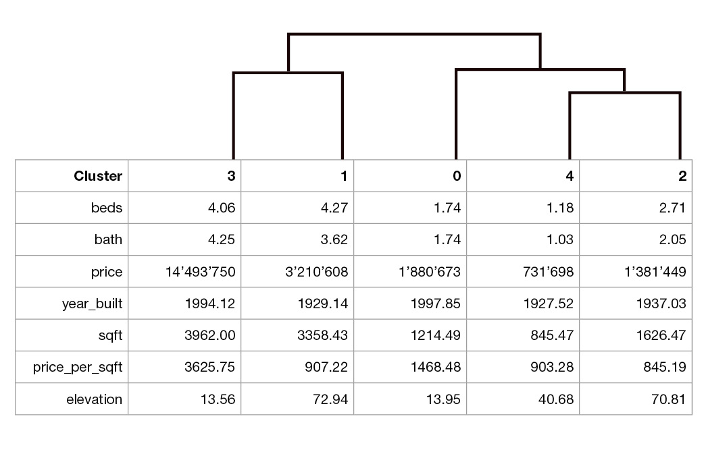
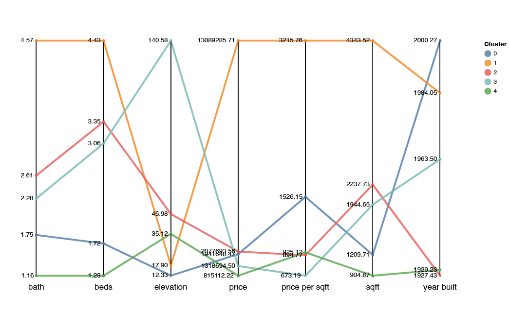
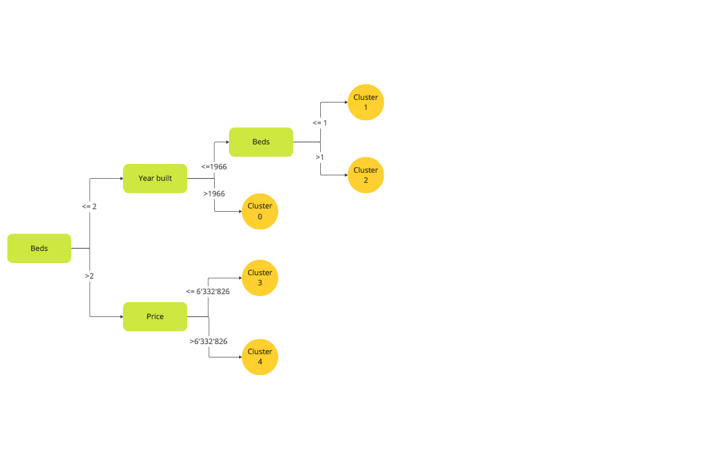

# ParTree - Data Partitioning through Tree-based Clustering Method

While existing clustering methods only provide the assignment of records to clusters without justifying the partitioning, we propose tree-based clustering methods that offer interpretable data partitioning through a shallow decision tree. 
These decision trees enable easy-to-understand explanations of cluster assignments through short and understandable split conditions. 
The proposed methods are evaluated through experiments on synthetic and real datasets and proved to be more effective than traditional clustering approaches and interpretable ones in terms of standard evaluation measures and runtime. 


## Setup

### Using PyPI

```bash
pip install partree
```

### Manual Setup

```bash
git clone https://github.com/cri98li/ParTree
cd ParTree
pip install -e .
```

## Running the code

```python
import pandas as pd
from ParTree import PrincipalParTree
from ParTree import print_rules

# load the data
df = pd.read_csv(dataset) 

#train the model
partree = PrincipalParTree()
partree.fit(X)

#extract the labels
labels = partree.labels_ 

#get the row explanation in a dictionary-like structure and print it
rules = partree.get_rules()
print(print_rules(rules, None, feature_names=df.columns))
```

You can find the software documentation in the `/docs/` folder and 
a powerpoint presentation on Geolet can be found [here]().
You can cite this work with
```
TODO
```


## Additional Material

Clustering logic visualizations for diabetes dataset. From left to right: ParTree, k-Means, Hier:

<p float="left">
    
     
    
</p>
